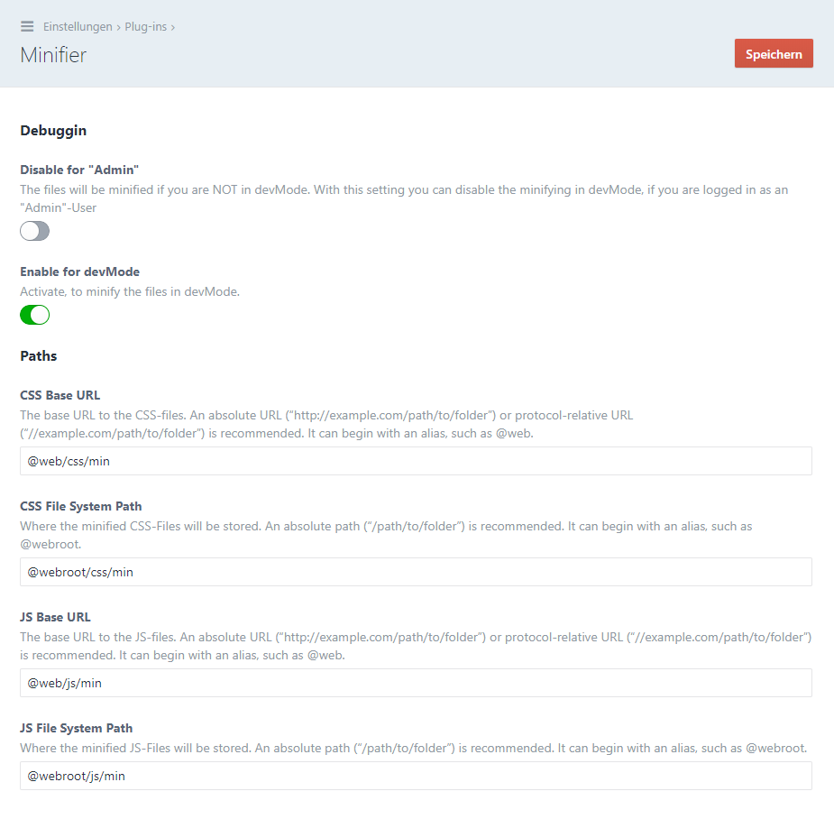

# Minifier plugin for Craft CMS 3.x

Minifier for CSS- and JavaScript-Files.

## Requirements

This plugin requires Craft CMS 3.0.0-beta.23 or later.

## Installation

To install the plugin, follow these instructions.

1. Open your terminal and go to your Craft project:

        cd /path/to/project

2. Then tell Composer to load the plugin:

        composer require bitboxde/minifier

3. In the Control Panel, go to Settings → Plugins and click the “Install” button for Minifier.

## Configuring Minifier

## Using Minifier

To register files, just do the following in Twig:

### CSS-File

#### Simple

    

Output: `<link href="/css/min/3f48a421fe28e0958090cc0061dec077.css?c=1548336831" rel="stylesheet">`

##### With options
    
        
Output: `<link media="print" href="/css/min/3f48a421fe28e0958090cc0061dec077.css?c=1548336831" rel="stylesheet">`
        
##### With Options and Target File
    
        
Output: `<link media="print" href="/css/min/print.css?c=1548336831" rel="stylesheet">`
        

#### Advanced

##### Multiple files
Both files will be combined.

    
    

Output: `<link href="/css/min/3f48a421fe28e0958090cc0061dec077.css?c=1548336831" rel="stylesheet">`

##### With same options
Both files will be combined.
        
    
    

Output `<link media="print" href="/css/min/3f48a421fe28e0958090cc0061dec077.css?c=1548336831" rel="stylesheet">`

##### With differenct options
Both files will be minified in a separate file.
        
    
    

Output

`<link media="print" href="/css/min/3f48a421fe28e0958090cc0061dec077.css?c=1548336831" rel="stylesheet">`

`<link href="/css/min/e4cf6efeb8b84ecd5eab28cea274c696.css?c=1548336831" rel="stylesheet">`

##### With differenct options and Target File
Both files will be combined and the options will be merged together.
        
    
    

Output `<link data-test="test" media="print" href="/css/min/all.css?c=1548336831" rel="stylesheet">`

## Minifier Roadmap

Some things to do, and ideas for potential features:

* More settings/options
  * save minified files in different folders (overwriting the plugin-settings)
* HTML-Minifier (currently beta)

If you have some interesting ideas, please write us!

Brought to you by [bitbox GmbH & Co. KG](https://www.bitbox.de)
