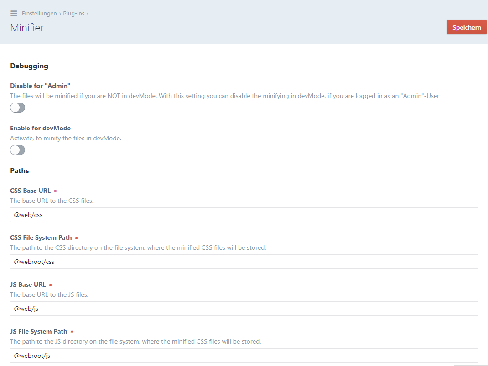

# Minifier plugin for Craft CMS 3.x

Minifier for CSS and JavaScript files.

## Requirements

This plugin requires Craft CMS 3.0.0-beta.23 or later.

## Installation

### Plugin Store (the easy way)
- In the Craft Control Panel, go to Settings -> Plugins
- Search for "Minifier"
- Click the "Install" button

### Composer Command Line (the manual way)
To install the plugin, follow these instructions.

1. Open your terminal and go to your Craft project:

        cd /path/to/project

2. Then tell Composer to load the plugin:

        composer require bitboxde/minifier

3. In the Control Panel, go to Settings → Plugins and click the “Install” button for Minifier.

## Configuring Minifier

> Please check settings before using. Possibly you need to change the paths.

## Documentation

 - **[Installation](docs/installation.md)**
 - **[Settings](docs/settings.md)** /  **[Advanced](docs/settings.md#advanced)**
 - **[Register files](docs/register-files.md)** / **[Advanced](docs/register-files.md#advanced)**
 - **[Multi-Site usage](docs/multi-site-usage.md)**
 - **[Events](docs/events.md)**
 - **[Integrate a CSS preprocessor (Sass / Less)](docs/integrate-a-css-preprocessor.md)**

## Minifier Roadmap

Some things to do, and ideas for potential features:

* External files
* HTML-Minifier (currently beta)

If you have some interesting ideas, please write us!

Brought to you by [bitbox GmbH & Co. KG](https://www.bitbox.de)
