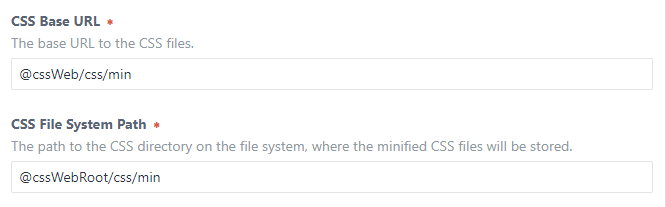

# Multi-Site usage

At the moment there isn't a native Multi-Site solution for setting up every single site, but we will work on it. Nevertheless, there
is a possibility to implement the Minifier in a Multi-Site-Craft.

## Different files for each site

This is the simple way. Just set it up like a Single-Site. But you need to know, that the files will be stored in the same
base-path-pattern you saved in the Plugin Settings. If you entered the path `@webroot/css/min`, in each webroot will be created the
`/css/min`-directory.

If you want dynamic paths, you need to solve this with aliases or enviroment variables.

## Same files for each site

To solve this problem you just need to work with aliases or enviroment variables.

An example of aliases:

Alias | Path
----- | ----
@cssWeb | https://www.site-one.com
@cssWebRoot | /absolute/path/to/web

### With same URL

An example for the Plugin-Settings:

Register Css file on the second site https://www.site-two.com

    
    
Output: `<link href="https://www.site-one.com/css/min/3f48a421fe28e0958090cc0061dec077.css?c=1548336831" rel="stylesheet">`

### With different URLs

Use the @web- and @webRoot-aliases in the Plugin-Settings. They are dynamic for each site. But register the file like this:

    

Output: `<link href="https://www.site-two.com/css/min/3f48a421fe28e0958090cc0061dec077.css?c=1548336831" rel="stylesheet">`